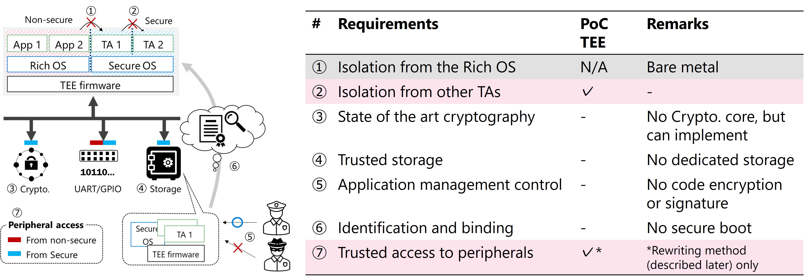

# RISC-V PoC TEE: Proof-of-Concept Trusted Execution Environment

[English README is here](https://github.com/pyth0n14n/PoC-TEE/blob/main/README.md )

PoC TEE (Proof-ofConcept Trusted Execution Environment) はRISC-V組込みデバイス向けのTEE実装です。
Hex Five製X300コア ([URL](https://github.com/hex-five/multizone-fpga)) を実装したFPGAボード Arty A7-35T 上で動作します。
Freedom Studioプロジェクトとして提供しています。

PoC TEEは、RISC-VベースのTEEの故障注入攻撃に対する耐性評価のために作成したものです（詳細は、[出版と引用](#出版と引用) に記載の論文を参照下さい）。アプリケーションの分離以外の機能には課題もあるため、ご注意の上ご使用下さい。

PoC TEEの構成と主な提供物は以下です (下図)。

- Monitor: PMP制御とコンテキストスイッチの管理
- APP1～3: Monitorにより分離されるアプリケーション


## システム要件

### ハードウェア

|項目|型番|説明|
|:--|:--|:--|
|FPGAボード|Arty A7-35t|Digilent 製FPGAボード ([URL](https://digilent.com/reference/programmable-logic/arty-a7/start))|
|RISC-Vコア|X300 |HexFive製のRISC-Vコア ([URL](https://github.com/hex-five/multizone-fpga))。UC Berkeley製RocketChipに基づく。|

Arty A7でのRISC-V開発環境構築 (JTAGケーブルやIDE等) については、Digilentの[チュートリアル](https://digilent.com/reference/programmable-logic/arty-a7/arty_a7_100_risc_v/start)をご参照ください。

### ソフトウェア

|項目|型番|説明|
|:--|:--|:--|
|IDE|Freedom Studio|v2019.08.2 ([URL](https://github.com/sifive/freedom-studio/releases))|
|暗号ライブラリ|micro-aes|SmarterDM製AESライブラリ ([URL](https://github.com/SmarterDM/micro-aes))|
|Python|3.7.3|PoC TEEソフトウェアとの通信確認のため|
|pyserial|3.4|PoC TEEソフトウェアとの通信確認のため|


## 利用方法

### 前提

1. Arty A7-35tにX300コアが焼かれている
2. Freedom StudioやGit環境が構築済みである

### 導入

1. リポジトリをクローンする: `$ git clone github.com/pyth0n14n/PoC-TEE`
2. サブモジュール (micro-aes) を取得する: `$ git submodule update --init`
3. FreedomStudioで新たなFreedom E SDK プロジェクトを作成する  
   Select Target: freedom-e310-arty  
   Select Example: empty  
   Project name: 任意 (例えば"PoCTEE")

   

4. PoC-TEE/FreedomStudio_projectファイルの中身を作成したプロジェクトにコピー・上書き  
   `cp -rf PoC-TEE/FreedomStudio_project/* PoCTEE/`
5. プロジェクトから `main.c, bsp/build` を削除する
6. リビルドして(`Clean -> Build`)、empty.elfを作成する  
   ビルドサイズは 0x9886 となる
7. empty.elfをX300コアを実装したArty A7に焼く

### 動作確認

1. 通信確認用スクリプトのポート番号を変更する: `PoC-TEE/script/usb_riscv.py` (L.18)
2. スクリプトを起動する: `$ python usb_riscv.py`
3. 下記のような挙動が確認できればOK  
   APP2によるAES暗号化結果とAPP3によるメモリダンプ結果が確認できる。
   APP3からAPP3(0x8000_3800)にはアクセスできるが、APP3からAPP2(0x8000_3000)にはアクセスできないことが確認できる。
   Monitorは、メモリアクセス例外に応じて共有メモリの内容を0xffで埋める。


### PMP用法の切り替え

PMPの利用方法に応じて、2種類のmonitorを作成した。

1. Rewriting: 1アプリケーションのために全PMPを上書きする
2. Switching: 無効化及び有効化するアプリケーションのPMPのXWR属性をスイッチする

利用したいmonitorコードをリネームしてsrcディレクトリのモニタコードに上書き下さい。

## 内容物

- FreedomStudio_project
  - bsp
    - metal.mod.lds  
      各アプリケーションのROM/RAM分離を実現するためのリンカスクリプト。
    - design.dts  
      PMPを有効化したデザイン
    - metal.h, metal-inline.h  
      PMPを有効化したヘッダファイル
  - src
    - monitor.c/h  
      PMP設定及びコンテキストスイッチの管理によりTEEを実現するモニタ。
      本モニタは、freedom-e-sdkで提供される3つの[サンプルアプリケーション](https://github.com/sifive/freedom-e-sdk/tree/master/software)を参考にしました。
      - exapmle-pmp
      - example-user-mode
      - example-syscall
    - shared.c/h  
      共有の関数と共有メモリ。
    - sep1  
      UARTユーザコマンドを受け付け、適宜実行するディスパッチャ。OSのような働きを持つ。
    - sep2  
      秘密鍵を持ち、AESを実行する。攻撃耐性評価における被害者アプリケーション。
    - sep3  
      コマンドで指定したアドレスをダンプする。攻撃耐性評価における攻撃者アプリケーション。
- freedom-metal/gross
  - crt0.S  
    FlashのコードをRAMに展開する。
- script
  - usb_riscv.py  
    PoC TEEの動作確認用通信スクリプト。SmartcardのAPDUを参考にした。
- monitor_rewriting.c/monitor_switching.c  
  2種類のPMP用法に基づくモニタ。
  ビルドサイズは 0x9886 (rewriting), 0x9932 (switching) となる。

### 動作


### 課題

PoC TEEはRISC-VベースのTEEの故障注入攻撃耐性を評価するためのソフトウェアであるため、アプリケーションを分離する以外の機能の実装に課題が存在する。

- ヒープメモリ  
  PoC TEEではヒープメモリは実装していない。したがって、ヒープメモリの分離は行われない。`mallo()`等を実行した時の動作は確認していない。
- ビルド設定の自動適用  
  リンカスクリプトにしたがって、3つのアプリケーションがハードコードされている。
  アプリケーションと分離設定にしたがってリンカスクリプトを自動生成するツールは提供していない。
- 例外ハンドラにおける`sp`の使用方法  
  例外ハンドラは`sp`を使用する。すなわち、モニタは例外ハンドリングの際に呼び出し元アプリケーションのスタックを利用することを意味する。
  ハンドラが呼び出された直後に変更すべきだが、Freedom Metalライブラリの改修が必要であったため、手を加えていない。
  このような実装は脆弱性となり得るが、攻撃耐性評価においては対象外の要素である。

### GlobalPlatform定義*1との比較

TEEには下記の7つの要件が求められます。PoC TEEは資源分離の検証に特化しているため、全ての性質を満たすわけではない点にご注意ください。



*1 GlobalPlatform, “Introduction to Trusted Execution Environments.”, May, 2018

## 出版と引用

このPoC TEE及びその一部のコードがお役に立ちましたら、引用いただけると幸甚です。
PoC TEEの説明については、スライドや論文もご参照下さい。

```bibtex
@online{nashimoto2022pocteegit,
  title={{PoC TEE: RISC-V Proof-of-Concept Trusted Execution Environment}},
  author={Nashimoto, Shoei and others},
  year={2022},
  publisher={GitHub},
  url={https://github.com/pyth0n14n/PoCTEE},
}

@inproceedings{nashimoto2022poctee,
  title={{PoC TEE: Proof-of-Concept Implementation of RISC-V Trusted Execution Environment for Embedded Devices}},
  author={Nashimoto, Shoei and Ueno, Rei and Naofumi, Homma},
  year={2022},
  booktitle={2nd Topics in hArdware SEcurity and RISC-V (TASER)},
}

@article{nashimoto2022bypassing,
  title={{Bypassing Isolated Execution on RISC-V using Side-Channel-Assisted Fault-Injection and Its Countermeasure}},
  author={Nashimoto, Shoei and Suzuki, Daisuke and Ueno, Rei and Homma, Naofumi},
  journal={IACR Transactions on Cryptographic Hardware and Embedded Systems},
  pages={28--68},
  year={2022}
}
```
