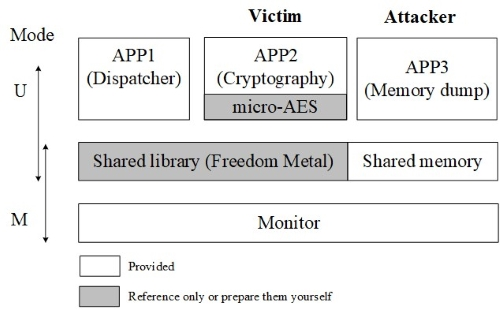
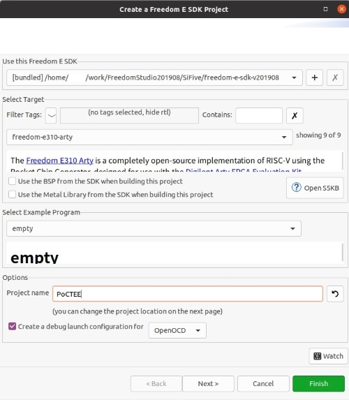
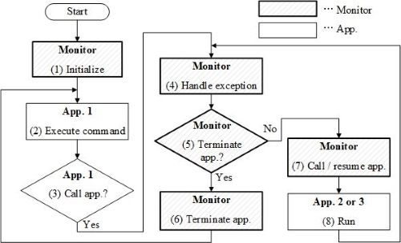

# RISC-V PoC TEE: Proof-of-Concept Trusted Execution Environment

[日本語版READMEはこちら](https://github.com/pyth0n14n/PoC-TEE/README-ja.md)

PoC TEE (Proof-ofConcept Trusted Execution Environment) is a proof-of-concept TEE implementation for RISC-V embedded devices.
It runs on an FPGA board Arty A7-35t implementing Hex Five's X300 RISC-V core ([URL](https://github.com/hex-five/multizone-fpga)).
It is available as a Freedom Studio project.

PoC TEE was created to evaluate the resilience of RISC-V-based TEEs to fault injection attacks.
See my paper at [Publications & Citation](#Publications&Citation) for details.
Please note that there are some [issues](#Drawbacks) with functions other than application isolation.


PoC TEE consists of the following.

- Monitor: Management PMP control and context switch management.
- APP1～3: Applications isolated by the monitor.



## System Requirement

### Hardware

|Item|Model|Description|
|:--|:--|:--|
|FPGA board|Arty A7-35t|Provided by Digilent ([URL](https://digilent.com/reference/programmable-logic/arty-a7/start))|
|RISC-V core|X300 |Provided by HexFive ([URL](https://github.com/hex-five/multizone-fpga)). Based on UC Berkeley's RocketChip.|

Please refer to Digilent's [tutorial](https://digilent.com/reference/programmable-logic/arty-a7/arty_a7_100_risc_v/start) for information on building a RISC-V development environment (JTAG cable, IDE, etc.) on Arty A7.

### Software

|Item|Model|Description|
|:--|:--|:--|
|IDE|Freedom Studio|v2019.08.2 ([URL](https://github.com/sifive/freedom-studio/releases))|
|Crypto. library|micro-aes|AES library by SmarterDM ([URL](https://github.com/SmarterDM/micro-aes))|
|Python|3.7.3|To verify the operation of PoC TEE|
|pyserial|3.4|To verify the operation of PoC TEE|

## Usage

### Assumption

1. The X300 core is implemented on Arty A7-35t.
2. Freedom Studio and Git are installed.

### Install

1. Clone this repository: `$ git clone github.com/pyth0n14n/PoC-TEE`
2. Get submodules (micro-aes): `$ git submodule update --init`
3. Create a new Freedom E SDK project as follows.
   Select Target: freedom-e310-arty
   Select Example: empty
   Project name: Arbitrary (e.g., "PoCTEE")

   

4. Copy and overwrite your project files with the contents of *PoC-TEE/FreedomStudio_project*
   `$ cp -rf PoC-TEE/FreedomStudio_project/* PoCTEE/`
5. Remove `main.c, bsp/build` from your project
6. `Clean` and `Build` to create `empty.elf`
   Build size must be 0x9886
7. Burn `empty.elf` to your Arty A7

### Confirmation

1. Change the UART port number of the python script: `PoC-TEE/script/usb_riscv.py` (L.18)
2. Run the script: `$ python usb_riscv.py`
3. OK if the following behavior is confirmed
   The results of AES encryption by APP2 and memory dump by APP3 can be seen.
   It confirms APP3 can access APP3 (0x8000_3800--), but APP3 cannot access APP2 (0x8000_3000--).
   The monitor fills the shared memory with 0xff in response to memory access fault.


### Switching PMP usages

Two types of monitors are provided, depending on how the PMP is used.

1. Rewriting: Overwrite all PMPs for one application.
2. Switching: Switch RWX attributes of PMP for applications to disable and enable.

Rename the monitor code you want to use and overwrite `src/monitor.c` with it.

## List of contents

- FreedomStudio_project
  - bsp
    - metal.mod.lds
      A liker script to realize ROM/RAM isolation for each application.
    - design.dts
      PMP enabled FPGA design.
    - metal.h, metal-inline.h
      PMP enabled header files.
  - src
    - monitor.c/h
      Monitor to achieve TEE by PMP configuration and context switch management.
      It is based on three [sample applications](https://github.com/sifive/freedom-e-sdk/tree/master/software) provided by freedom-e-sdk (SiFive).
      - exapmle-pmp
      - example-user-mode
      - example-syscall
    - shared.c/h
      Shared functions and memory.
    - sep1
      Dispatcher that receives user commands via UART and execute them as needed, acting like an operating system.
    - sep2
      It has a secret key and executes AES. A victim application in security evaluation in [the paper](#Publications&Citation).
    - sep3
      It dumps memory specified by the command. An attacker application in security evaluation in [the paper](#Publications&Citation).
- freedom-metal/gross
  - crt0.S
    Relocate codes in flash memory to RAM.
- script
  - usb_riscv.py
    Communication script to check PoC TEE operation, based on smartcards' APDU.
- monitor_rewriting.c/monitor_switching.c
  Monitors based on two kinds of PMP usages.
  Build size must be 0x9886 (rewriting) and 0x9932 (switching).

### Operational flow



### Drawbacks

Since PoC TEE is software for evaluating the fault injection attack resistance of RISC-V based TEEs, some drawbacks exist in implementing features other than application isolation.

- Heap memory:
  PoC TEE does not implement heap memory, which means heap memory is not isolated.
  Not sure how it works when `malloc()` etc. is executed.
- Fixed isolation settings:
  Three applications are isolated based on the linker script.
  No tools are provided to automatically generate linker scripts according to the application and isolation settings.
- Usage of `sp` in exception handlers:
  Exception handlers use `sp`.
  This means that the monitor uses the stack of the caller application for exception handling.
  This should be changed immediately after the handler is invoked, but has not been fixed because it required modifications to the Freedom Metal library.

## Publications & Citation

If PoC TEE helps you I would be glad if you cite them.
For more information on PoC TEE, please refer to the paper.

```bibtex
@online{nashimoto2022poctee,
  title={PoC TEE: RISC-V Proof-of-Concept Trusted Execution Environment},
  author={Nashimoto, Shoei and others},
  year={2022},
  publisher={GitHub},
  url={https://github.com/pyth0n14n/PoCTEE},
}

@article{nashimoto2022bypassing,
  title={Bypassing Isolated Execution on RISC-V using Side-Channel-Assisted Fault-Injection and Its Countermeasure},
  author={Nashimoto, Shoei and Suzuki, Daisuke and Ueno, Rei and Homma, Naofumi},
  journal={IACR Transactions on Cryptographic Hardware and Embedded Systems},
  pages={28--68},
  year={2022}
}
```
